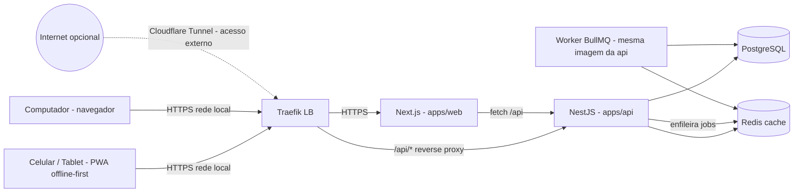
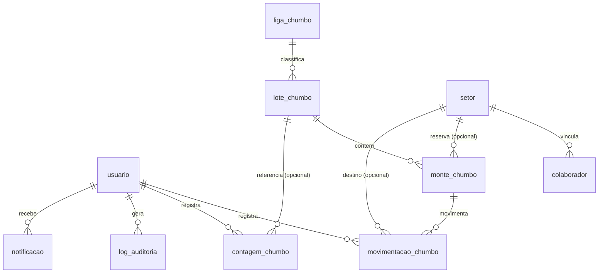
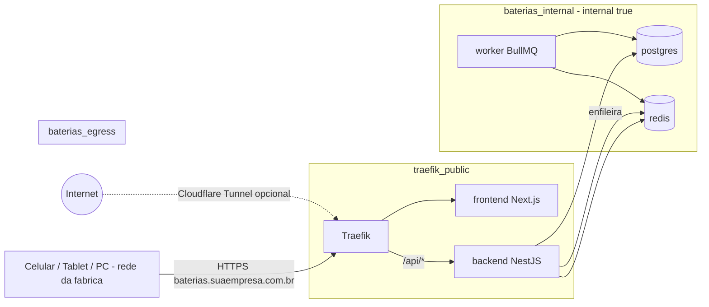

# PRD — Baterias: Sistema de Gestão para Fábrica de Baterias

> **Módulo 1 do sistema:** Controle de Chumbo
> **Stack:** Node.js >= 20 · TypeScript (strict) · NestJS · Next.js (App Router) · PostgreSQL + Prisma · BullMQ + Redis · Tailwind CSS + shadcn/ui · PWA offline-first (Serwist + Dexie) · Docker · Docker Swarm · Traefik · Cloudflare DNS · Let's Encrypt wildcard TLS (DNS-01).
> **Produção:** Servidor local na fábrica (rede local com HTTPS válido), acesso externo opcional via Cloudflare Tunnel.
> **Idioma do código de domínio:** PT-BR sem acentos (snake_case). **Infraestrutura/rotas de API:** inglês. **Idioma da interface:** Português brasileiro. **Timezone:** `America/Sao_Paulo`.
> **Registry:** `ghcr.io/<SEU-USUARIO-GITHUB>/baterias-backend` e `ghcr.io/<SEU-USUARIO-GITHUB>/baterias-frontend`.

---

## 1. Visão Geral

O **Baterias** é um sistema modular de gestão para uma **fábrica de baterias automotivas para motocicletas**, criado para substituir as planilhas de Excel hoje espalhadas pela fábrica, compartilhadas via Dropbox, com acesso simultâneo de várias pessoas e sem controle de alterações.

O sistema é um **PWA (Progressive Web App)** que funciona no celular, tablet e computador, **offline-first**: todas as operações do dia a dia funcionam mesmo sem internet (chão de fábrica com instabilidade de rede) e sincronizam automaticamente quando a conexão volta.

A arquitetura é **modular por domínio**: o sistema cresce módulo a módulo (chumbo, teleiras, empaste, etc.), sem vínculos automáticos de movimentação entre módulos no primeiro momento. O **Módulo 1 — Controle de Chumbo** digitaliza o controle de estoque, liberação, movimentação e consumo de chumbo, seguindo fielmente as posições do estoque físico em uma grade 2D interativa.

Mesmo sendo operado inicialmente por **um único usuário**, o sistema nasce com **login por usuário, controle de acesso e auditoria completa** (quem fez, quando fez, qual era o valor anterior), pronto para receber mais usuários e módulos no futuro sem retrabalho.

A entrega é containerizada com Docker, desenvolvida localmente com Docker Compose e implantada em um **servidor local na fábrica** com Docker Swarm, atrás de Traefik com TLS wildcard emitido por Let's Encrypt via challenge DNS-01 com Cloudflare — garantindo HTTPS válido na rede local (requisito para o PWA offline) e funcionamento mesmo com a internet indisponível.

---

## 2. Objetivos do Produto

1. Eliminar as planilhas de Excel espalhadas e o compartilhamento via Dropbox, centralizando os dados em um único sistema.
2. Garantir sincronia imediata das informações entre celular, tablet e computador.
3. Registrar trilha de auditoria completa de toda movimentação de dados: quem criou/editou/excluiu, quando, e quais eram os valores anteriores.
4. Prevenir erros de digitação, exclusão e edição acidental com validações, confirmações e seleção guiada (botões, menus suspensos, calendários).
5. Reduzir o esforço de preenchimento: mínimo de digitação, máximo de seleção e automação.
6. Funcionar offline no chão de fábrica (PWA instalável) com sincronização automática ao reconectar.
7. Estruturar o sistema em módulos independentes, permitindo evolução incremental sem acoplamento prematuro.
8. Oferecer dashboards e relatórios dinâmicos e ricos para análise de todo o processo.
9. Manter a rastreabilidade total do chumbo: do lote que chega à fábrica até a reserva, movimentação ao setor ou venda.
10. Garantir um deploy resiliente, acessível pela rede local mesmo sem internet, com backups rotineiros.

---

## 3. Público-Alvo

- **Gestor/Almoxarife da fábrica** — usuário inicial e único do sistema; opera o controle de chumbo via celular, tablet e computador.
- **Operadores de máquinas (futuro)** — colaboradores que, em uma fase posterior, farão apontamentos de consumo do próprio setor.
- **Administração da fábrica** — consome relatórios, dashboards e análises para tomada de decisão.

---

## 4. Problemas que o Sistema Resolve

- **Fragmentação e perda de sincronia** das planilhas compartilhadas pelo Dropbox entre celular e computador.
- **Ausência de auditoria**: hoje não há registro de quem editou, quando editou ou qual era o dado anterior antes de uma edição/exclusão.
- **Erros de digitação, exclusão e edição acidental** sem prevenção ou histórico de recuperação.
- **Preenchimento massivo, repetitivo e propenso a erro** — sem validação, sem padronização.
- **Dificuldade de análise**: cruzar dados de várias planilhas é lento e manual.
- **Falta de rastreabilidade do chumbo**: lotes, montes, reservas por setor e saídas não são rastreáveis.
- **Divergências entre contagem física e saldo registrado** sem comparação estruturada.
- **Indisponibilidade de sistemas 100% on-line** no chão de fábrica: o sistema precisa operar offline.

---

## 5. Escopo do Produto

- **Autenticação e usuários**: login por email com JWT (access + refresh), perfis de acesso (ADMIN, OPERADOR), recuperação de senha, pronto para multiusuário.
- **Auditoria transversal**: trilha imutável de todas as operações (criação, edição, exclusão) com valores anteriores e novos.
- **Módulo Configurações**: cadastro de ligas de chumbo (com cor), modelos de grade, polaridades, colaboradores (vinculados a setores) e setores.
- **Módulo 1 — Controle de Chumbo**:
  - Entrada de chumbo (apontamento único de remessa/lote com grade 2D).
  - Estoque de chumbo (grade 2D viva por lote, cards de resumo, operação de almoxarifado).
  - Ações por monte: Reservar, Mover ao setor, Baixa/Venda, Editar.
  - Regras de peso: peso real vs. peso estimado com reconciliação automática por lote.
  - Contagem diária de chumbo com revisão comparativa contra o saldo do sistema.
  - Rastreabilidade por monte e por lote (histórico completo).
- **PWA offline-first**: instalável no celular/tablet, operações offline com fila local e sincronização automática (idempotente e com tratamento de conflitos).
- **Dashboard do chumbo**: métricas, gráficos e indicadores por liga, lote, setor e período.
- **Relatórios**: exportação em XLSX e PDF com filtros aplicados.
- **Notificações internas**: conclusão de tarefas assíncronas (relatórios, sincronização).
- **Infraestrutura**: Docker Compose local; Docker Swarm + Traefik em servidor local na fábrica com TLS wildcard DNS-01; acesso externo opcional via Cloudflare Tunnel; scripts de deploy e backup.

---

## 6. Fora de Escopo Inicial

- **Vínculos automáticos entre módulos** (ex.: empastadeira consumindo somente o estoque produzido pela teleira) — será feito em fase posterior.
- **Consumo de chumbo na teleira** (apontamento de consumo real no setor) — regras detalhadas serão especificadas em sprint futura.
- **Módulos de produção** (teleiras, paradas de máquina, empaste, contagem de grades, dashboard geral por setor) — roadmap futuro; masseira, montagem e formação já possuem sistema próprio.
- **Operação multiusuária efetiva** — a arquitetura e o login por usuário existem desde o dia 1, mas apenas o usuário ADMIN é provisionado inicialmente.
- **Agentes de IA** (resumos, chat) — módulo futuro; a infraestrutura de filas (BullMQ + Redis) já fica pronta.
- **Aplicativo mobile nativo** — a UI responsiva em PWA atende celular e tablet.
- **Importação automática das planilhas Excel legadas** — previsto como evolução (importador), não no escopo inicial.
- **Testes automatizados** — requisito explícito: não implementar testes.
- **Pagamentos, multi-tenant, integrações externas não solicitadas.**

---

## 7. Roadmap de Módulos Futuros

| Ordem | Módulo | Observações |
|---|---|---|
| 1 | **Controle de Chumbo** | Escopo deste PRD. |
| 2 | Apontamentos de produção — Teleiras | Produção de grade, lotes 001–999, paradas de máquina, média/hora. |
| 3 | Empaste | Lote automático `EP{DDMMAAAA}`, consumo de óxido, perdas. |
| 4 | Contagem/conferência de estoque de grades | Contagem física vs. produção acumulada, divergências. |
| 5 | Consumo de chumbo na teleira | Consome o estoque do setor; fecha o ciclo do chumbo. |
| 6 | Vínculos entre módulos | Movimentações automáticas entre módulos. |
| 7 | Agentes de IA | Resumos e chat com LangChain.js/LangGraph.js sobre a base do sistema. |
| — | Masseira, Montagem, Formação | Já possuem sistema próprio — não fazer. |

---

## 8. Personas e Perfis de Usuário

| Perfil | Descrição | Permissões |
|---|---|---|
| **ADMIN** | Gestor/almoxarife — usuário único inicial. | Acesso total: configurações, entrada de chumbo, estoque, todas as ações de movimentação, contagem, relatórios, dashboard, auditoria. |
| **OPERADOR** (futuro) | Operador de máquina de um setor. | Apenas apontamento de consumo do próprio setor (quando o módulo de consumo existir). Sem acesso a configurações, entradas, vendas ou auditoria. |

> Todo usuário autentica por email + senha. A identidade do usuário é obrigatória em toda operação gravada (auditoria), mesmo com um único usuário ativo.

---

## 9. Visão Funcional do Sistema

O sistema é organizado em grandes blocos funcionais:

1. **Conta & Acesso:** Login por email → dashboard do módulo ativo.
2. **Configurações:** Ligas de chumbo (com cor), modelos de grade, polaridades, colaboradores, setores.
3. **Controle de Chumbo — Entrada:** Apontamento único de remessa criando o lote e seus montes na grade 2D.
4. **Controle de Chumbo — Estoque:** Filtro por liga, resumos (disponível/setor/reservado), grade 2D por lote com operação de almoxarifado (seleção, ações, reorganização).
5. **Controle de Chumbo — Contagem Diária:** Apontamentos físicos por liga, totais do dia e revisão contra o saldo do sistema.
6. **Auditoria:** Timeline por registro e consulta filtrável de todas as alterações.
7. **Dashboards & Relatórios:** Métricas do chumbo, gráficos, exportação XLSX/PDF.
8. **Operação Offline (PWA):** Fila local de mutações, sincronização automática, tratamento de conflitos.
9. **Infraestrutura:** Servidor local com Swarm/Traefik, backups, healthchecks.

## 10. Requisitos Funcionais

### 10.1 Usuários e Autenticação

- **RF-A01** Login por **email** e senha (não username), com JWT: access token de curta duração + refresh token com rotação.
- **RF-A02** Hash de senha com argon2id.
- **RF-A03** Usuário ADMIN provisionado no seed inicial (email/senha via `.env` no primeiro acesso); alteração de senha autenticada.
- **RF-A04** Recuperação de senha: por email quando SMTP configurado no `.env`; caso não haja SMTP, redefinição via comando CLI no servidor (documentado), nunca em texto puro no repositório.
- **RF-A05** RBAC com perfis ADMIN e OPERADOR desde o dia 1; guards por rota e por perfil no backend; menu do frontend oculta recursos não permitidos ao perfil.
- **RF-A06** Toda operação de escrita registra o usuário autenticado (contexto do token, nunca do payload).
- **RF-A07** Gestão de usuários (listar, criar, editar, ativar/desativar) restrita ao ADMIN — prepara a futura adição de operadores.

### 10.2 Configurações

Menu com todos os cadastros de base do sistema. Todos com criar/editar/ativar/desativar (exclusão lógica — registros em uso não podem ser desativados se referenciados por movimentações; exclusão física nunca).

- **RF-C01** Cadastro de **ligas de chumbo** com: nome (único, obrigatório) e **cor** (obrigatória; paleta padrão: azul, vermelho, verde, amarelo, cinza, preto). A cor identifica visualmente a liga em todo o sistema (grade, cards, relatórios).
- **RF-C02** Cadastro de **modelos de grade** (nome único, obrigatório).
- **RF-C03** ~~Cadastro de polaridades~~ — **removido em 2026-09-10** (decisão do cliente): polaridade é fixa (POSITIVO|NEGATIVO, enum no código/banco), sem necessidade de CRUD.
- **RF-C04** Cadastro de **setores** (nome único, obrigatório; ex.: teleiras, boleira, moinho, masseira, empastadeira, montagem, formação).
- **RF-C05** Cadastro de **colaboradores**: nome (obrigatório) e setor (obrigatório). Colaborador **não é usuário do sistema** — serve apenas para informar o operador da máquina nos apontamentos futuros.
- **RF-C06** Todas as telas de cadastro com validação de duplicidade, feedback de erro em português brasileiro e confirmação para ações destrutivas.

### 10.3 Controle de Chumbo — Entrada de Chumbo (apontamento de remessa)

> O menu **Chumbo** agrupa três telas: **Entrada de chumbo**, **Estoque de chumbo** e **Contagem de chumbo**. **Não existe CRUD isolado de lote** — o lote nasce dentro do apontamento de entrada.

- **RF-E01** **Apontamento único de entrada** — uma única tela registra uma remessa/lote de chumbo com:
  - **Data da chegada** — pré-preenchida com a data de hoje, editável via calendário.
  - **Número do lote** — informado manualmente; código único do lote (validação de duplicidade em tempo real).
  - **Liga de chumbo** — uma liga por apontamento (lote); toda a remessa é da mesma liga; seleção via menu suspenso com as ligas ativas.
  - **Fornecedor** — informativo (interno/externo); 50 ou 35 barras por monte como padrão sugerido, conforme o fornecedor.
  - **Peso total informado (opcional)** — usado quando a pesagem da remessa foi feita **em uma única vez**, sem peso individual por monte (ver RF-P01).
  - **Grade 2D pré-configurada com 2 linhas × 5 colunas**, expansível no momento do cadastro (adicionar/remover linhas e colunas conforme a posição física real).
- **RF-E02** **Interação da grade na entrada** — a grade **não tem aparência de tabela**: cada célula é um **botão**. Ao tocar/clicar em uma célula na posição onde o chumbo fisicamente está, abre um **popup** com os campos **peso** e **quantidade de barras** daquele monte (e indicação da **ordem de armazenamento/sequência de liberação**, ver RF-E03). Células vazias permanecem limpas. Ao final do preenchimento, salvar cria o lote e um **monte por célula marcada**, todos com status `EM_ESTOQUE`.
- **RF-E03** **Ordem de liberação** — padrão derivado da posição na grade (**de cima para baixo, da esquerda para a direita**), editável no cadastro (sequência explícita). Usada ao liberar múltiplos montes (RF-M04).
- **RF-E04** Cada lote possui **sua própria grade 2D** (linhas × colunas persistidas no lote, expansível posteriormente pela tela de estoque). A posição de cada monte é `(lote, linha, coluna)` — única por lote.
- **RF-E05** Ao salvar a entrada: se `peso_total_informado` foi preenchido e os montes **não** foram pesados individualmente, cada monte nasce **sem peso real** e com **peso estimado** (RF-P01). Se os montes foram pesados individualmente, os pesos reais são gravados direto.
- **RF-E06** O resumo do lote (peso total, barras totais, quantidade de montes) é calculado automaticamente e exibido antes de salvar (confirmação em um passo).
- **RF-E07** Lotes encerrados (todos os montes vendidos/movidos/ajustados) permanecem consultáveis com histórico completo; nunca são excluídos.

### 10.4 Controle de Chumbo — Estoque (operação no almoxarifado)

- **RF-S01** **Tela de estoque** — filtro instantâneo por liga (≈ 5–6 ligas; seleção via botões/chips coloridos com a cor da liga). Ao escolher a liga:
  - **Card de resumo principal** com três conjuntos: **Disponível no estoque** (peso + barras), **No setor** (peso + barras — saiu do almoxarifado, está em algum setor) e **Reservado** (peso + barras, **apenas informativo** — não desconta de nenhum dos valores anteriores).
  - **Cards expansíveis por lote** — o cabeçalho do card mostra em destaque: **lote**, **data da chegada**, **peso total**, **quantidade de barras que chegou** e **quantidade de montes**. Ao expandir: um **card de resumo idêntico ao principal, porém restrito àquele lote**, seguido da **grade 2D do lote com os montes em suas posições**.
- **RF-S02** **Grade 2D viva** — o tamanho da grade se movimenta conforme a quantidade necessária (linhas/colunas expansíveis/retráteis pelo próprio lote). Células com monte renderizam como **botões** com identificação visual: cor da liga, peso, barras e status; células vazias permanecem discretas.
- **RF-S03** **Interação na grade** (comportamento por clique/toque):
  - **1 clique** seleciona; **1 clique novamente** deseleciona (múltipla seleção permitida). **1 clique em área vazia** deseleciona tudo.
  - **2 cliques rápidos** em item selecionado abre o **card de menu de ações** (RF-M01).
  - **2 cliques rápidos** em item **não disponível** (vendido/movido integralmente) abre um **mini-resumo**: para onde foi, quando, e link para o histórico completo.
  - **Clique longo** (ou modo de reorganização) habilita **arrastar o monte para outra posição**, reorganizando a grade fisicamente (posição nova validada como vazia).
- **RF-S04** **Identificação visual dos montes**: selecionado, reservado, parcial, no setor, vendido/movido (não disponível), ajustado — via cor, borda, selo ou ícone, com legenda acessível.
- **RF-S05** **Responsividade** — em telas pequenas (celular), **somente a grade** ganha barra de rolagem horizontal; demais elementos (cards de resumo) permanecem visíveis. No desktop não há rolagem.
- **RF-S06** **Rastreabilidade por monte** — cada monte exibe: liga (via lote), lote, peso (real ou estimado, com marcação visual), barras, status, posição 2D e **histórico completo de movimentações** (timeline: data, ação, usuário, detalhes).
- **RF-S07** **Fórmulas de saldo** (exibidas nos cards de resumo):
  - `Disponível no estoque` = Σ montes com status EM_ESTOQUE, RESERVADO ou PARCIAL (pesos: reais quando existirem, estimados caso contrário; barras restantes).
  - `No setor` = Σ movimentações do tipo MOVIMENTO_SETOR (barras e pesos movidos aos setores), agrupado por liga.
  - `Reservado` = Σ montes com status RESERVADO (ou barras reservadas).
  - `Vendido/Baixado` = Σ movimentações do tipo BAIXA_VENDA.
- **RF-S08** **Permissões** — o ADMIN opera tudo; o OPERADOR (futuro) fará apenas apontamento de consumo do seu setor (fora do escopo do Módulo 1).

### 10.5 Controle de Chumbo — Ações e Movimentações

- **RF-M01** **Menu de ações** (aberto por 2 cliques em monte selecionado; disponível para 1 ou N montes selecionados): **Reservar**, **Mover ao setor**, **Baixa/Venda**, **Editar**, além de **Ver histórico**.
- **RF-M02** **Reservar** — separa o monte para um setor de destino (menu suspenso com setores ativos) + observação opcional. O chumbo **continua no estoque**, mas fica **marcado visualmente como separado** (status RESERVADO; o card de resumo exibe "Reservado" apenas informativamente). Reserva não é exclusiva por setor: o monte fica vinculado ao setor escolhido.
- **RF-M03** **Mover ao setor** — registra que o chumbo **saiu do estoque do almoxarifado** e ficou disponível no estoque do setor (**não é consumo**; ocorre em poucas quantidades durante o dia). Campos: setor (se o monte estava reservado, o setor **já vem preenchido**; caso contrário, informar), observação opcional e **quantidade de barras** (permite mover fração do monte).
  - Se a quantidade movida **= total de barras do monte**: status passa a `NO_SETOR` com setor vinculado.
  - Se a quantidade movida **< total**: o monte permanece no estoque com as **barras restantes** (status visual PARCIAL); a parte movida é registrada na movimentação com o setor.
  - Pode mover diretamente ou mover os que estão reservados (a reserva é consumida pela movimentação).
- **RF-M04** **Múltiplos montes selecionados** — a liberação segue a **ordem da grade (cima→baixo, esquerda→direita)** ou a **ordem de liberação explícita** (RF-E03), aplicada automaticamente na sequência das movimentações criadas.
- **RF-M05** **Baixa/Venda** — quando o chumbo não vai para nenhum setor e simplesmente **sai da fábrica** (venda ou saída). Campos: destino (informativo), **para quem**, observação (aparece no relatório), **data** (default hoje, editável via calendário), **quantidade de barras** e **peso** (automático pela média, editável — RF-P04).
- **RF-M06** **Editar monte** — corrigir peso ou quantidade de barras do monte; reflete **imediatamente** nos totais (disponível ou não). Toda edição gera movimentação do tipo EDICAO + registro de auditoria com valores anteriores/novos.
- **RF-M07** **Cancelar reserva** — devolve o monte ao estado EM_ESTOQUE (registrado na timeline).
- **RF-M08** Toda ação (reserva, movimento, venda, edição, cancelamento) grava: tipo, status anterior e novo, barras, peso, setor/destino, observação, data e **usuário autenticado** — e alimenta a timeline do monte, do lote e a auditoria.

### 10.6 Controle de Chumbo — Regras de Peso (estimado vs. real e reconciliação)

> Este subsistema é **CRÍTICO**. Toda aritmética usa `Decimal` no servidor (nunca float).

- **RF-P01** **Peso estimado na entrada** — quando o monte não é pesado individualmente na entrada e o lote tem `peso_total_informado`:
  `peso_estimado = (peso_total_informado / barras_totais_do_lote) × barras_do_monte`, exibido com marcação visual de **"estimado"**.
- **RF-P02** **Peso real se torna autoritativo** — na primeira movimentação em que o monte é pesado de fato (mover/venda com peso informado), o peso real gravado se torna autoritativo para aquele monte.
- **RF-P03** **Reconciliação do lote** — ao registrar o primeiro peso real de um monte do lote, o sistema **recalcula o peso estimado dos montes ainda não pesados** do mesmo lote:
  `peso_estimado_monte = ((peso_informado − Σ pesos_reais_já_registrados) / barras_restantes_não_pesadas) × barras_do_monte`,
  absorvendo a diferença de balança nos montes restantes. O recálculo é registrado na timeline do lote.
- **RF-P04** **Peso médio por barra em movimentações parciais** — ao operar movimentações por quantidade de barras, o peso é automático pela média do monte (`peso / barras`), **com opção de edição manual**. Ao editar manualmente o peso de uma fração movida, **as barras/peso restantes do monte se auto-ajustam** recalculando a média.
- **RF-P05** **Ajuste residual** — quando **todos** os montes do lote são pesados, qualquer diferença residual (`peso_total_informado − Σ pesos_reais`) vira um **ajuste de arredondamento** registrado no histórico do lote (auditável), sem alterar os pesos reais.
- **RF-P06** **Fechamento do resumo do lote** — o resumo do lote **sempre fecha com o peso informado** enquanto houver montes estimados; ao final, bate com a soma dos pesos reais + ajuste residual.
- **RF-P07** **Lote sem peso total informado** — se o lote não tem `peso_total_informado` e o monte não foi pesado, o peso é exibido como "—" (não estimado); os totais de peso somam apenas os pesos conhecidos (marcados). A reconciliação não se aplica.

### 10.7 Controle de Chumbo — Contagem Diária

- **RF-CT01** **Menu de contagem** com **data** (pré-preenchida hoje, editável via calendário) e **card de apontamentos**: **liga** (obrigatória; seleção via botões coloridos), **quantidade de barras** (obrigatória; teclado numérico no mobile), **lote** (opcional; menu suspenso), **observação** (opcional). Botão **Adicionar**.
- **RF-CT02** Ao adicionar, exibe abaixo um **card de totais por liga** (soma das barras apontadas por liga nesse dia) seguido do **histórico do dia** com os apontamentos individuais (editáveis/excluíveis enquanto do mesmo dia, com auditoria).
- **RF-CT03** Botão **Revisar** compara a contagem com o sistema: mostra, dentro do card de totais, a **quantidade de barras que o sistema aponta** por liga, com destaque de divergências. A contagem do sistema considera **estoque + setores** (total físico na fábrica, independentemente de onde esteja — exclui apenas vendas/baixas).
- **RF-CT04** Apontamentos persistidos por dia, por usuário; histórico consultável por período.
- **RF-CT05** Divergências da revisão ficam registradas com a data, permitindo acompanhar a evolução das divergências no dashboard.

### 10.8 Auditoria e Rastreabilidade

- **RF-AU01** Trilha de auditoria **imutável** em todas as entidades críticas (lotes, montes, movimentações, contagens, configurações, usuários): ação (criação/atualização/exclusão), **usuário**, **data/hora**, **valores anteriores e novos (JSON)**, por registro.
- **RF-AU02** A auditoria é gerada automaticamente por interceptor/eventos no backend — o usuário vem sempre do contexto autenticado.
- **RF-AU03** **Timeline por registro** — em lote, monte e movimentação: linha do tempo visual das operações.
- **RF-AU04** Consulta de auditoria filtrável por entidade, registro, usuário e período (restrita ao ADMIN).
- **RF-AU05** Registros de auditoria nunca são editados nem excluídos pela aplicação.

### 10.9 PWA e Operação Offline

- **RF-O01** O frontend é um **PWA instalável** (manifest + ícones + service worker): "Adicionar à tela inicial" no celular/tablet abre em tela cheia, como aplicativo.
- **RF-O02** **Leitura offline** — telas de estoque, lotes, configurações e dashboard consultáveis sem internet (cache + snapshot local em IndexedDB).
- **RF-O03** **Escrita offline** — entrada de lote, ações de movimentação, edições e contagens funcionam offline: a operação é aplicada otimisticamente na UI e **enfileirada localmente** com estado PENDENTE.
- **RF-O04** **Sincronização automática** ao reconectar (listener de conexão + background sync), enviando a fila em ordem (FIFO) com feedback visual de progresso.
- **RF-O05** **Idempotência** — cada operação offline leva uma chave de idempotência (UUID); retries de rede nunca duplicam movimentações no servidor.
- **RF-O06** **Conflitos** — o servidor valida cada operação contra o estado atual do recurso (versão/concorrência otimista); se o estado mudou (ex.: monte já movido por outro dispositivo), responde o estado atual e o cliente marca a operação como **CONFLITO** para **revisão manual** do usuário (reaplicar ou descartar), sem perda de informação.
- **RF-O07** **UX de conectividade** — indicador online/offline, contador de pendências (badge), feedback "sincronizado" ao concluir e notificação interna quando a fila esvazia.

### 10.10 Dashboard e Relatórios

- **RF-D01** Dashboard do chumbo com: saldo por liga (estoque/setor/reservado), entradas × saídas (setor/venda) por período, barras e peso movidos por setor, divergências de contagem, aging de lotes (tempo desde a chegada × barras restantes) e percentual pesado vs. estimado por lote.
- **RF-D02** Filtros por período (dia/semana/mês), liga, lote e setor; gráficos com Recharts; cards de métricas.
- **RF-R01** Menu e tela dedicada a relatórios com filtros aplicáveis: **Movimentações de chumbo** (período, liga, lote, tipo, setor), **Saldo de estoque** por liga/lote, **Contagens e divergências**, **Baixas/Vendas**.
- **RF-R02** Exportação em **XLSX** (exceljs) e **PDF** (pdfmake, fontes PT-BR), com filtros aplicados e nome de arquivo claro e datado.
- **RF-R03** Relatórios pesados rodam via BullMQ (não bloqueantes): loading no botão + notificação interna ao concluir.

### 10.11 Notificações Internas

- **RF-N01** Notificações internas (sininho/toast) ao concluir tarefas assíncronas: relatório pronto, sincronização concluída, falhas de conflito aguardando revisão.
- **RF-N02** Notificações persistidas por usuário, com marcação de lida e link direto para o recurso.

## 11. Requisitos Não Funcionais

| ID | Categoria | Descrição |
|---|---|---|
| RNF-01 | Responsividade | UI responsiva em todos os tamanhos e dimensões de tela; **mobile-first** (uso intenso no chão de fábrica); na tela de estoque, somente a grade rola horizontalmente em telas pequenas. |
| RNF-02 | Offline-first | PWA instalável; todas as operações do Módulo 1 funcionam offline; sincronização automática, idempotente e com tratamento de conflitos ao reconectar. |
| RNF-03 | Desempenho | Filtros instantâneos (por liga, lote), telas e processos rápidos; nada bloqueante; relatórios pesados em filas (BullMQ). |
| RNF-04 | Segurança | Rotas protegidas (JWT + RBAC); dados sensíveis não expostos; uploads privados; segredos nunca versionados; helmet e rate limiting. |
| RNF-05 | Auditoria | Toda criação/edição/exclusão registra usuário, data/hora e valores anteriores/novos; auditoria imutável. |
| RNF-06 | UX | Preenchimento guiado com o **mínimo de digitação**: botões, menus suspensos, calendários, teclado numérico onde aplicável; confirmação em ações destrutivas; feedback assíncrono (loading + toast). |
| RNF-07 | Idioma/Timezone | Interface em português brasileiro; datas persistidas em UTC e exibidas em `America/Sao_Paulo`; campos de domínio em PT-BR sem acentos (snake_case); infraestrutura/rotas em inglês. |
| RNF-08 | Precisão numérica | Pesos e quantidades com `Decimal` no servidor (nunca float); reconciliação de lote fecha matematicamente com o peso informado. |
| RNF-09 | Disponibilidade local | Sistema acessível na rede local **mesmo com a internet indisponível** (DNS local + TLS válido emitido via DNS-01). |
| RNF-10 | Resiliência (Swarm) | `restart_policy` (on-failure + delay + max_attempts + window) e resource limits/reservations em todos os serviços. |
| RNF-11 | Zero-downtime | `update_config` com `order start-first` e `failure_action rollback` no backend e frontend. |
| RNF-12 | Subida ordenada | Nenhum serviço em crash-loop por dependência não pronta — healthchecks + `wait-for-db` + restart_policy com delay. |
| RNF-13 | Backups | Backup diário do PostgreSQL e uploads com rotação (7 diários + 4 semanais), pronto para cron. |
| RNF-14 | Sem testes | Não implementar testes automatizados (requisito explícito do projeto). |

---

## 12. Glossário de Termos de Domínio

| Termo | Descrição |
|---|---|
| **Liga** | Tipo de liga de chumbo: **Liga 6** (positiva, amarelo), **Liga 5** (negativa, vermelho), **Liga 0** (chumbo puro, preto/sem cor — para óxido e misc), **Liga 4** (chumbo+estanho Sn, verde). |
| **Monte / Pilha** | Aglomerado de barras de chumbo (quantidade variável; geralmente 50 barras para fornecedor interno e 35 para fornecedor externo). |
| **Barra de chumbo** | Unidade de chumbo; peso aproximado de 21 a 28 kg (~26 kg, não é regra). |
| **Lote de chumbo** | Remessa de chumbo que chega à fábrica; código único informado manualmente no apontamento de entrada; toda a remessa é da mesma liga. |
| **Peso estimado** | Quando o monte não é pesado individualmente na entrada: `(peso_total_informado / barras_totais_do_lote) × barras_do_monte`, marcado como estimado. Ao surgir o primeiro peso real, o sistema reconcilia os montes restantes do lote. |
| **Estoque / Almoxarifado** | Local de armazenamento do chumbo na fábrica; posição física representada pela grade 2D do lote. |
| **Reserva** | Monte separado para um setor, mas ainda fisicamente no almoxarifado (marcação visual). |
| **Mover ao setor** | Saída do estoque do almoxarifado para o estoque do setor (disponível para uso; **não é consumo**). |
| **Baixa/Venda** | Saída definitiva do chumbo da fábrica (venda ou saída). |
| **Contagem diária de chumbo** | Conferência física diária (estoque + setores) do total de barras por liga, comparada com o saldo do sistema. |
| **Setores** | Teleiras (fundidora de grade), boleira, moinho, masseira, empastadeira, montagem, formação. |
| **Grade** | Estrutura de chumbo produzida nas teleiras que receberá a massa ativa (contexto dos módulos futuros). |
| **Painel / Placa** | Grade após aplicação da massa ativa / lâminas que compõem a bateria (contexto dos módulos futuros). |
| **Teleira** | Fundidora de grade; atualmente 3 (4ª em implantação) — módulo futuro. |
| **Empastadeira** | Máquina única que aplica a massa ativa sobre a grade — módulo futuro. |
| **Masseira** | Equipamento que produz a massa ativa — já possui sistema próprio. |
| **Óxido** | Material derivado do chumbo puro (Liga 0), consumido no empaste. |

---

## 13. Arquitetura Técnica

### 13.1 Stack

| Camada | Tecnologia |
|---|---|
| Linguagem | TypeScript (strict) sobre Node.js >= 20 LTS |
| Monorepo | pnpm workspaces (`apps/api`, `apps/web`, `packages/shared`) |
| Backend | NestJS |
| Frontend | Next.js (App Router) |
| UI | Tailwind CSS + shadcn/ui |
| Banco de dados | PostgreSQL |
| ORM / Migrations | Prisma (`prisma migrate`) |
| Cache de servidor / Filas | Redis |
| Filas assíncronas | BullMQ (+ @bull-board/nestjs em rota protegida) |
| Autenticação | JWT (Passport) — access + refresh com rotação |
| Validação | Zod (schemas compartilhados em `packages/shared`) |
| PWA | Serwist (service worker) + Dexie (IndexedDB) |
| Data no cliente | TanStack Query · TanStack Table · react-hook-form · Recharts |
| PDF / XLSX | pdfmake · exceljs |
| Logging | pino (nestjs-pino) com request-id |
| Web server / LB | Traefik |
| DNS | Cloudflare |
| TLS | Let's Encrypt wildcard (DNS-01) |
| Container local | Docker Compose |
| Container produção | Docker Swarm (servidor local na fábrica) |
| Registry | GHCR — `ghcr.io/<SEU-USUARIO-GITHUB>/baterias-backend` e `baterias-frontend` |
| Documentação | MKDocs (Mermaid) + PROJECT_MAP.md |

### 13.2 Diagrama de Componentes (Mermaid)



> O Traefik roteia o tráfego HTTPS: o domínio principal serve o frontend Next.js e repassa `/api/*` ao backend NestJS. O worker consome filas do Redis e nunca recebe tráfego HTTP.

---

## 14. Arquitetura Modular e Monorepo

- **Monorepo pnpm workspaces** com três pacotes:
  - `apps/api` — NestJS (backend + imagem do worker).
  - `apps/web` — Next.js (frontend PWA).
  - `packages/shared` — schemas Zod, tipos TypeScript, enums e constantes de domínio **compartilhados** entre backend e frontend (fonte única de verdade dos contratos).
- **Modularidade de domínio**: cada módulo de negócio (chumbo, configurações, auditoria...) é um módulo NestJS isolado e um grupo de rotas no frontend. Novos módulos (teleiras, empaste...) entram **sem alterar** os existentes — o sistema cresce módulo a módulo, sem vínculos automáticos entre eles no primeiro momento.
- **Sem multi-tenant** — sistema de fábrica única. O isolamento por usuário/perfil (RBAC) existe desde o dia 1.
- **Nomenclatura** (obrigatória):
  - Domínio (entidades, campos Prisma, regras de negócio): **PT-BR sem acentos em snake_case** — ex.: `lote_chumbo.qtd_barras`.
  - Infraestrutura, rotas de API e código técnico: **inglês simples** — ex.: `POST /api/lead-lots`.
  - UI e mensagens: **português brasileiro**.
- Toda tabela/model tem `created_at` (`@default(now())`) e `updated_at` (`@updatedAt`).

---

## 15. Segurança, Autenticação e Permissões

### 15.1 Autenticação

- Login por email + senha; JWT com access token de curta duração + refresh token com rotação (armazenamento httpOnly cookie no frontend ou armazenamento seguro com expiração curta).
- Hash argon2id; proteção de login com rate limiting (@nestjs/throttler).

### 15.2 Autorização

- Guards globais de autenticação; decorator de perfil (`@Roles('ADMIN')`) nos endpoints sensíveis.
- ADMIN: acesso total. OPERADOR (futuro): somente apontamento de consumo do próprio setor.
- O frontend oculta menus/ações não permitidos, mas **a autorização é sempre revalidada no backend**.

### 15.3 Hardening

- Helmet (CSP, headers de segurança), CORS restrito a `CORS_ORIGINS` do `.env` (https em produção), trust proxy para o Traefik.
- Erros de API padronizados, sem vazamento de stack traces em produção.
- `.env` gitignored; segredos de produção via Docker Secrets; validação do `.env` com Zod no startup (fail fast).
- Uploads (futuros anexos) servidos apenas por endpoint autenticado — nunca por diretório público.

---

## 16. Proteção de Arquivos e Uploads Privados

- O Módulo 1 não possui anexos, mas a infraestrutura já define o padrão: uploads futuros (ex.: fotos de romaneio) ficam em volume nomeado `uploads` e são servidos por endpoint autenticado do backend, com validação de permissão e `Content-Disposition` apropriado.
- O frontend Next.js serve apenas seus próprios assets estáticos; nenhum arquivo de usuário é exposto publicamente.

---

## 17. Contratos e Validação de Dados (Zod Compartilhado)

- Todos os contratos de entrada/saída da API são **schemas Zod em `packages/shared`**, usados por:
  - **Backend**: validação de DTOs (nestjs-zod) nas rotas.
  - **Frontend**: react-hook-form + zodResolver nos formulários — o mesmo schema que valida o formulário valida a API.
- Contratos mínimos do Módulo 1:
  - `loginSchema` (email, senha).
  - `entradaLoteSchema` (data_chegada, codigo, liga_id, fornecedor, peso_total_informado?, linhas, colunas, montes[] com linha, coluna, peso?, qtd_barras, ordem_liberacao?).
  - `reservaSchema`, `movimentoSetorSchema` (setor_id, qtd_barras, peso?, observacao?), `baixaVendaSchema` (destino, para_quem, data, qtd_barras, peso?, observacao?), `edicaoMonteSchema`.
  - `contagemSchema` (data, liga_id, qtd_barras, lote_id?, observacao?).
  - `ligaSchema`, `setorSchema`, `colaboradorSchema`, `modeloGradeSchema`, `polaridadeSchema`.
- Regras transversais nos schemas: datas ISO; quantidades inteiras > 0; pesos Decimal ≥ 0 com até 2 casas; strings com limites de tamanho.

---

## 18. Módulos NestJS Recomendados

Módulos em `apps/api/src/`:

| Módulo | Responsabilidade |
|---|---|
| `core/` | **CoreModule**: ConfigModule com validação Zod, PrismaService, guards globais de auth, TerminusModule (`/api/health`, `/api/health/ready`), pino logger, helmet, throttler, CORS. |
| `shared/` | **SharedModule**: interceptors (auditoria, request-id), exception filters, decorators, utils, paginação, helpers Decimal. |
| `auth/` | Login, refresh/rotação de tokens, alteração/recuperação de senha, perfis (ADMIN/OPERADOR), guards de perfil. |
| `configuracoes/` | Ligas de chumbo, setores, colaboradores, modelos de grade, polaridades (CRUDs com ativação/desativação). |
| `chumbo/` | Lotes (entrada/apontamento), montes, grade 2D, movimentações (reserva/movimento/venda/edição), regras de peso e reconciliação, contagem diária e revisão. |
| `auditoria/` | Log de auditoria (escrita via eventos), timeline por registro, consulta filtrável. |
| `notificacoes/` | Notificações internas por usuário (criação, listagem, marcar lida). |
| `relatorios/` | Geração XLSX/PDF (exceljs/pdfmake), jobs BullMQ, endpoints de download. |
| `dashboard/` | Agregações e métricas do chumbo (saldos, evolução, divergências). |
| `queues/` | Registro das filas BullMQ, workers de relatórios, bull-board em rota protegida. |

> Convenção: services concentram as regras de domínio (reconciliação de peso, fórmulas de saldo, ordem de liberação); controllers são enxutos; eventos de domínio via `@nestjs/event-emitter`.

---

## 19. Modelagem Inicial de Domínio (Prisma)

> Campos de domínio em PT-BR sem acentos (snake_case); toda tabela com `created_at` e `updated_at`; pesos `Decimal @db.Decimal(10,2)`.

### 19.1 Enums

```text
PerfilUsuario      ADMIN | OPERADOR
StatusMonte        EM_ESTOQUE | RESERVADO | NO_SETOR | PARCIAL | VENDIDO | AJUSTADO
TipoMovimentacao   ENTRADA | RESERVA | CANCELAMENTO_RESERVA | MOVIMENTO_SETOR | BAIXA_VENDA | EDICAO | RECONCILIACAO | AJUSTE
AcaoAuditoria      CRIACAO | ATUALIZACAO | EXCLUSAO
```

### 19.2 Models

**usuario** — `id`, `email` (único), `senha_hash`, `nome_completo`, `perfil` (PerfilUsuario), `ativo`, timestamps.

**liga_chumbo** — `id`, `nome` (único), `cor` (azul|vermelho|verde|amarelo|cinza|preto), `ativo`, timestamps.

**setor** — `id`, `nome` (único), `descricao?`, `ativo`, timestamps.

**colaborador** — `id`, `nome`, `setor_id` (FK setor), `ativo`, timestamps.

**modelo_grade** — `id`, `nome` (único), `ativo`, timestamps.

**polaridade** — `id`, `nome` (POSITIVO|NEGATIVO), `ativo`, timestamps.

**lote_chumbo** — `id`, `codigo` (único), `data_chegada` (Date), `liga_id` (FK), `fornecedor` (INTERNO|EXTERNO|OUTRO, informativo), `peso_total_informado` (Decimal?), `total_barras` (Int), `total_montes` (Int), `linhas` (Int), `colunas` (Int), timestamps.
- Relação 1:N com `monte_chumbo`.

**monte_chumbo** — `id`, `lote_id` (FK), `linha` (Int), `coluna` (Int), `ordem_liberacao` (Int), `qtd_barras` (Int), `peso_real` (Decimal?), `peso_estimado` (Decimal?), `status` (StatusMonte), `setor_reserva_id` (FK setor?), timestamps.
- `@@unique([lote_id, linha, coluna])` — posição única por lote.
- Peso exibido = `peso_real ?? peso_estimado` (marcado "estimado" quando cair no estimado).

**movimentacao_chumbo** — `id`, `monte_id` (FK), `lote_id` (FK), `tipo` (TipoMovimentacao), `status_anterior?`, `status_novo?`, `qtd_barras` (Int), `peso` (Decimal?), `setor_id` (FK setor?), `destino` (String?), `para_quem` (String?), `observacao` (String?), `data` (Date), `usuario_id` (FK usuario), `created_at`.
- **Append-only**: movimentações nunca são editadas ou excluídas — correções geram novas movimentações (EDICAO/AJUSTE).

**contagem_chumbo** — `id`, `data` (Date), `liga_id` (FK), `qtd_barras` (Int), `lote_id` (FK lote_chumbo?), `observacao` (String?), `divergencia_sistema` (Int?, calculada na revisão), `revisada_em` (DateTime?), `usuario_id` (FK), `created_at`.

**log_auditoria** — `id`, `entidade` (String), `entidade_id` (Int), `acao` (AcaoAuditoria), `dados_anteriores` (Json?), `dados_novos` (Json?), `usuario_id` (FK), `created_at`. Sem update/delete pela aplicação.

**notificacao** — `id`, `titulo`, `mensagem`, `url?`, `lida` (Boolean, default false), `usuario_id` (FK), `created_at`.

### 19.3 Diagrama ER (Mermaid)



## 20. Fluxos Principais do Sistema

### 20.1 Entrada de lote (apontamento de remessa)

1. Usuário abre **Chumbo → Entrada de chumbo**.
2. A tela abre com **data de hoje pré-preenchida** (editável via calendário), campo **lote**, **liga** (menu suspenso) e **fornecedor** (informativo).
3. Abaixo, a **grade 2D pré-configurada 2×5** (botões, sem aparência de tabela), expansível (adicionar linhas/colunas).
4. Ao tocar em uma célula, abre **popup** com **peso** e **quantidade de barras** do monte daquela posição (e sequência de liberação, default = ordem da grade).
5. Se a remessa foi pesada em uma única vez, informa o **peso total** (opcional) — os montes sem peso individual nascem **estimados** (RF-P01).
6. Resumo do lote (peso, barras, montes) é exibido para conferência.
7. Ao **salvar**: cria o lote e um monte por célula marcada, status `EM_ESTOQUE`; movimentações do tipo ENTRADA são registradas; auditoria gravada.

### 20.2 Reserva de monte

1. Na tela de estoque (liga escolhida), expande o card do lote.
2. **1 clique** seleciona o monte (ou vários).
3. **2 cliques** abrem o menu de ações → **Reservar**.
4. Informa o **setor de destino** + observação opcional → confirmar.
5. O monte ganha status `RESERVADO` e marcação visual "separado para {setor}"; permanece contando no disponível do estoque; timeline atualizada.

### 20.3 Movimentação ao setor

1. Seleciona um ou mais montes na grade → **2 cliques** → **Mover ao setor**.
2. Se o monte estava reservado, o **setor já vem preenchido**; caso contrário, informa o setor.
3. Informa **quantidade de barras** (fração permitida) e observação opcional. Peso automático pela **média do monte** (`peso / barras`), editável — ao editar, as barras restantes se auto-ajustam (RF-P04).
4. **Múltiplos montes**: a liberação segue a **ordem da grade** (cima→baixo, esquerda→direita) ou ordem explícita (RF-E03).
5. Movimentação do tipo MOVIMENTO_SETOR gravada com usuário/data; monte atualizado:
   - fração total → status `NO_SETOR`;
   - fração parcial → barras restantes no estoque, marcação visual de parcial.
6. Se o monte tinha apenas peso estimado, o peso informado vira **peso real** e dispara a **reconciliação do lote** (RF-P03).

### 20.4 Baixa/Venda

1. Seleciona o monte → menu de ações → **Baixa/Venda**.
2. Informa: destino, **para quem**, observação (consta no relatório), **data** (default hoje, editável), **quantidade de barras**, **peso** (auto pela média, editável).
3. Confirmar → movimentação BAIXA_VENDA; monte `VENDIDO` (ou parcial); sai dos totais físicos da fábrica.

### 20.5 Edição de monte

1. Menu de ações → **Editar** — corrige peso ou quantidade de barras.
2. Alteração reflete **imediatamente** nos totais; movimentação EDICAO + auditoria com valores anteriores/novos.

### 20.6 Reconciliação de peso (automática)

1. Primeira pesagem real de um monte do lote (via movimentação) → peso real autoritativo.
2. Sistema recalcula `peso_estimado` dos montes ainda não pesados do lote: `(peso_informado − Σ pesos_reais) / barras_restantes × barras_do_monte`.
3. Recálculo registrado na timeline do lote (movimentação RECONCILIACAO, sem usuário — sistema).
4. Quando todos os montes forem pesados: diferença residual vira **ajuste de arredondamento** auditável (RF-P05); o resumo do lote fecha com Σ pesos reais + ajuste.

### 20.7 Contagem diária e revisão

1. **Chumbo → Contagem de chumbo**: data pré-preenchida (editável).
2. Apontamentos: **liga** (botões coloridos), **barras** (teclado numérico), lote (opcional), observação → **Adicionar**.
3. Exibe **totais por liga** do dia + histórico dos apontamentos individuais.
4. **Revisar**: dentro do card de totais, mostra as **barras por liga segundo o sistema** (estoque + setores) e destaca divergências; divergência persistida com a data (RF-CT05).

### 20.8 Operação offline e sincronização

1. Celular no chão de fábrica **sem internet**: usuário instala o PWA (uma vez, com internet) e opera normalmente.
2. Entradas, movimentações e contagens são aplicadas localmente (otimista) e **enfileiradas** (IndexedDB) com estado PENDENTE; badge de pendências visível.
3. Ao reconectar: a fila é enviada em ordem (FIFO), cada item com **Idempotency-Key** (UUID).
4. Servidor valida contra o estado atual: sucesso → confirmado; estado mudou → **409 com estado atual** → operação marcada CONFLITO para **revisão manual** (reaplicar/descartar).
5. Ao esvaziar a fila: feedback "sincronizado" + notificação interna.

### 20.9 Reorganização da grade

1. Na grade do lote, **clique longo** no monte habilita o modo de arraste.
2. Arrasta para posição vazia → posição `(linha, coluna)` atualizada; auditoria registra a mudança; ordem de liberação é recalculada se derivada da posição.

---

## 21. PWA, Cache e Sincronização Offline

### 21.1 Estrutura

- **Serwist** gera o service worker do Next.js: precache do app shell (assets estáticos) e runtime cache das chamadas GET da API.
- **Dexie (IndexedDB)** persiste:
  - **Snapshots de leitura**: estoque por liga, lotes, configurações — exibidos offline com marcação de "dados de {data/hora}".
  - **Fila de mutações**: `{ id_uuid, endpoint, método, payload, versão_do_recurso, estado: PENDENTE | ENVIANDO | CONFIRMADO | CONFLITO }`.

### 21.2 Regras

- **Optimistic UI**: a mutação reflete imediatamente na interface local (com selo "pendente") — o usuário nunca espera internet.
- **Ordem FIFO**: as operações sincronizam na ordem em que foram criadas (a posição do monte e o saldo dependem da sequência).
- **Idempotência**: cada item da fila leva UUID; o servidor armazena chaves já processadas (Redis, TTL 24h) e responde o mesmo resultado em retries.
- **Concorrência otimista**: mutações carregam a `versão` (updated_at) do recurso; o servidor rejeita com 409 + estado atual quando a versão diverge; conflitos ficam em lista de revisão no app, sem descarte silencioso.
- **Autenticação offline**: refresh token armazenado com segurança; se o access token expirar offline, a fila continua acumulando e o refresh acontece ao reconectar (falha de refresh → login novamente, fila preservada).
- **Limite prático**: 1 usuário, múltiplos dispositivos (celular + desktop) — conflitos são raros mas tratados; nada é perdido (fila local + auditoria no servidor).

### 21.3 UX de conectividade

- Indicador permanente online/offline; badge com contagem de pendências; toast de progresso ("sincronizando 3 de 7"); notificação "Tudo sincronizado"; lista de conflitos com ação de revisão.

---

## 22. Dashboard e Métricas

### 22.1 Conteúdo (Módulo 1 — Chumbo)

- **Cards de resumo** por liga selecionada e total geral: Disponível no estoque (peso + barras), No setor (peso + barras), Reservado (informativo), Vendido acumulado.
- **Entradas × Saídas** por período (barras/peso): entradas de lotes, movimentos ao setor, baixas/vendas.
- **Movimentação por setor** (barras/peso por período) — para onde o chumbo está indo.
- **Aging de lotes**: dias desde a chegada × barras restantes (destaca lotes parados).
- **Peso estimado vs. real** por lote: percentual de montes pesados e o quanto a estimativa convergiu.
- **Divergências de contagem**: evolução das divergências por liga nas últimas contagens.

### 22.2 Implementação

- Endpoints de agregação no módulo `dashboard/` (groupBy do Prisma), cache curto em Redis quando aplicável.
- Gráficos no frontend com Recharts a partir de JSON do backend; filtros de período (dia/semana/mês), liga, lote e setor.

---

## 23. Relatórios, PDF e XLSX/CSV

### 23.1 Ferramentas

- **XLSX**: exceljs (o usuário vive no Excel — planilhas bem formatadas, com cabeçalho, filtros e larguras de coluna).
- **PDF**: pdfmake com fontes com suporte completo a PT-BR; layouts tabulares com totais.

### 23.2 Relatórios do Módulo 1

| Relatório | Filtros | Formatos |
|---|---|---|
| Movimentações de chumbo | período, liga, lote, tipo, setor | XLSX, PDF |
| Saldo de estoque de chumbo | liga, lote | XLSX |
| Contagens diárias e divergências | período, liga | XLSX, PDF |
| Baixas/Vendas | período, liga, lote, destino | XLSX, PDF |

### 23.3 Regras

- Sempre com os filtros aplicados; nome de arquivo claro e datado (ex.: `movimentacoes-chumbo_2026-08-01_2026-08-31.xlsx`).
- Relatórios pesados via BullMQ: loading no botão + notificação interna com link para download ao concluir.
- Dados sempre consistentes com as fórmulas de saldo (RF-S07).

---

## 24. Design System e UI/UX

### 24.1 Base

- **Tailwind CSS + shadcn/ui**; tema claro com bom contraste entre elementos, fontes e fundo; componentes acessíveis.

### 24.2 Princípios

- **Mobile-first e PWA**: alvo principal é o celular no chão de fábrica — botões grandes, áreas de toque confortáveis, teclado numérico para quantidades.
- **Mínimo de digitação**: seleção por botões/chips (ligas coloridas), menus suspensos (setores, lotes), calendários (datas), padrões pré-preenchidos (data de hoje, setor da reserva, peso pela média).
- **Grade 2D ≠ tabela**: células renderizam como **botões** com a cor da liga, peso, barras e selo de status; o tamanho da grade se adapta (expansível) e só ela rola horizontalmente no mobile.
- **Feedback imediato**: loading em botões, spinners, toasts; confirmação explícita em ações destrutivas (baixa/venda, edições).
- **Estados visuais dos montes**: selecionado, reservado, parcial, no setor, vendido/indisponível, ajustado — com legenda sempre acessível.
- Interface 100% em **português brasileiro**; datas no formato dd/mm/aaaa e timezone `America/Sao_Paulo`.

### 24.3 Componentes-chave

- Grade 2D interativa (seleção múltipla, duplo clique para ações, arraste para reorganizar).
- Cards de resumo expansíveis (lote → grade).
- Timeline de histórico (monte/lote/movimentação).
- Filtros instantâneos por liga (chips coloridos).
- Notificações internas (sininho + toast), badge de pendências offline.

---

## 25. Documentação e PROJECT_MAP.md

- Pasta `docs/` com toda a documentação sempre atualizada, servida com **MKDocs** (suporte a Mermaid): arquitetura, deploy, manual de uso (entrada, movimentações, contagem, offline), runbook de restore.
- **PROJECT_MAP.md** na raiz com: stack, arquitetura do banco (resumo dos models e fórmulas de saldo), fluxos lógicos (entrada → reserva → movimento → venda; reconciliação; contagem; offline), ferramentas e **Log de Execução** (último passo concluído e próximo pendente), atualizado constantemente durante o desenvolvimento.

---

## 26. Dados Fake para Demonstração

- Seed (`prisma/seed.ts` com @faker-js/faker) criando: usuário ADMIN, ligas (Liga 6/amarelo, Liga 5/vermelho, Liga 0/preto, Liga 4/verde), setores, colaboradores, modelos de grade e polaridades.
- Lotes de exemplo com montes em posições variadas (grades 2×5, 2×8, 3×6), mix de pesos reais e estimados, fornecedores interno/externo.
- Movimentações históricas realistas: reservas, movimentos parciais ao setor (com ajuste de média), vendas, edições — com **datas variadas** nos últimos 60 dias.
- Contagens diárias com e sem divergência.
- Objetivo: demonstração realista do sistema imediatamente após `docker compose up`.

---

## 27. Estrutura Recomendada de Pastas

```
baterias/
├── apps/
│   ├── api/                          # NestJS (backend + imagem do worker)
│   │   ├── src/
│   │   │   ├── core/                 # CoreModule: config (Zod), PrismaService, auth global, health, logger
│   │   │   ├── shared/               # SharedModule: interceptors, filters, decorators, utils Decimal
│   │   │   ├── auth/                 # login, JWT, refresh, perfis, guards
│   │   │   ├── configuracoes/        # ligas, setores, colaboradores, modelos, polaridades
│   │   │   ├── chumbo/               # lotes, montes, grade 2D, movimentacoes, pesos, contagem
│   │   │   ├── auditoria/            # log de auditoria, timeline, consulta
│   │   │   ├── notificacoes/
│   │   │   ├── relatorios/           # XLSX/PDF + jobs BullMQ
│   │   │   ├── dashboard/
│   │   │   └── queues/               # filas, workers, bull-board (rota protegida)
│   │   ├── prisma/                   # schema.prisma, migrations, seed.ts
│   │   ├── entrypoint-backend.sh     # wait-for-db → pg_advisory_lock → prisma migrate deploy → start
│   │   ├── entrypoint-worker.sh      # wait-for-db apenas → start:worker
│   │   └── Dockerfile                # multi-stage (usada pelo backend e worker)
│   └── web/                          # Next.js (PWA)
│       ├── src/app/                  # rotas: (auth)/login, chumbo/(entrada|estoque|contagem), configuracoes, dashboard, relatorios, auditoria
│       ├── src/components/           # grade-2d, cards, timeline, filtros, notificacoes
│       ├── src/lib/                  # api client (fetch + auth), query client, offline (dexie, sync, fila)
│       ├── public/                   # manifest.webmanifest, ícones PWA
│       └── Dockerfile                # multi-stage com output standalone
├── packages/
│   └── shared/                       # schemas Zod, tipos, enums, constantes de domínio
├── docs/                             # MKDocs + PRD.md
├── scripts/
│   ├── deploy.sh
│   └── backup.sh
├── docker/
│   ├── docker-compose.yml
│   ├── docker-stack.yml
│   └── traefik/traefik.yml
├── PROJECT_MAP.md
├── pnpm-workspace.yaml
├── package.json
├── .env                              # gitignored (dev)
├── .env.production                   # gitignored (produção, no servidor)
├── .gitignore
└── README.md
```

## 28. Configuração Local com Docker Compose

### 28.1 Serviços locais

- `backend` (NestJS) — entrypoint: wait-for-db → advisory lock → `prisma migrate deploy` → start.
- `frontend` (Next.js).
- `worker` (mesma imagem do backend, `entrypoint-worker.sh`).
- `postgres`, `redis`.
- `traefik` (opcional em local; em dev pode-se expor portas diretas).

### 28.2 Regras locais

- Rede bridge única (simplificação de desenvolvimento).
- Hot reload com volumes montados (`pnpm dev` nos apps).
- `.env` de desenvolvimento na raiz: `DATABASE_URL`, `REDIS_URL`, `JWT_SECRET`, `CORS_ORIGINS=http://localhost:3000`.
- Healthchecks locais nos serviços de infraestrutura; `docker compose up` deve deixar o sistema utilizável de ponta a ponta (com seed de demonstração).

---

## 29. Deploy em Produção — Servidor Local na Fábrica (Docker Swarm)

### 29.1 Visão

- Servidor Ubuntu (mini-PC/NUC ou desktop dedicado) instalado **na rede da fábrica**, com IP fixo local.
- Docker Swarm **single-node**; imagens publicadas no GHCR; deploy com `docker stack deploy --with-registry-auth`.
- **HTTPS válido na rede local** via Traefik + certificado wildcard Let's Encrypt emitido por **DNS-01** com Cloudflare (o registro A do domínio aponta para o **IP local**, DNS only/proxy desativado).
- **PWA exige HTTPS** — por isso o certificado válido é mandatório, não opcional.
- **Funcionamento sem internet**: configurar **DNS local** (roteador ou dnsmasq/Pi-hole no próprio servidor) apontando o domínio para o IP local — os dispositivos resolvem o nome na rede, mesmo com a internet caída; o certificado permanece válido. A renovação do certificado (a cada ~60 dias) exige internet no momento da renovação.
- **Acesso externo opcional** via Cloudflare Tunnel (seção 31).

### 29.2 Serviços do stack

`frontend`, `backend`, `worker`, `postgres`, `redis`, `traefik` (+ `cloudflared` opcional).

### 29.3 Volumes nomeados (persistência)

- `baterias_postgres`
- `baterias_uploads`
- `baterias_letsencrypt`

### 29.4 Redes overlay (mandatório)

| Rede | Tipo | Acesso | Serviços |
|---|---|---|---|
| `traefik_public` | external | Tráfego HTTP externo (rede local) | `frontend`, `backend`, `traefik` |
| `baterias_internal` | `internal: true` | Sem acesso à internet | `postgres`, `redis`, `backend`, `worker`, `frontend` |
| `baterias_egress` | overlay (sem internal) | Internet (egress para APIs externas) | `worker`, (`cloudflared`) |

**Regras mandatórias:**

- `frontend` e `backend` em `traefik_public` **e** `baterias_internal`.
- `postgres` e `redis` **apenas** em `baterias_internal`.
- `worker` em `baterias_internal` **e** `baterias_egress` (futuras APIs externas).
- **Nunca** colocar `worker` ou `postgres` na `traefik_public`.

### 29.5 Diagrama de redes (Mermaid)



### 29.6 Traefik e TLS

- Certificado **wildcard** cobrindo o domínio e `*.<domínio>`, Let's Encrypt via **DNS-01** com provider Cloudflare (resolvers 1.1.1.1/1.0.0.1).
- **Não** usar `tlschallenge` e `dnschallenge` ao mesmo tempo no resolver.
- Token Cloudflare: escopo **Zone > DNS > Edit**, zona do domínio; armazenado como **Docker Secret** `CLOUDFLARE_DNS_API_TOKEN`, lido via `CF_DNS_API_TOKEN_FILE=/run/secrets/CLOUDFLARE_DNS_API_TOKEN`.
- Redirect HTTP → HTTPS; roteamento: domínio principal → `frontend`; `/api/*` → `backend`.
- Como o acesso é pela rede local (não passa pelo proxy da Cloudflare), não configurar `forwardedHeaders.trustedIPs` — apenas trust proxy no backend para o Traefik interno.

### 29.7 Resiliência

- `restart_policy` (on-failure, delay, max_attempts, window) e `resources.limits/reservations` em todos os serviços.
- `backend` e `frontend` com `update_config`: `order: start-first`, `failure_action: rollback`.
- Entrypoints com `wait-for-db` evitam crash-loop; migrations com advisory lock garantem consistência.

---

## 30. Guia Completo de Deploy do Servidor Local do Zero

> Substitua os placeholders `<...>` por valores reais. Nunca commit valores reais. Domínio de exemplo: `baterias.suaempresa.com.br`.

### 30.1 Preparar o servidor

```bash
ssh <USUARIO>@<IP_LOCAL_DO_SERVIDOR>
sudo apt update && sudo apt upgrade -y
sudo apt install -y ca-certificates curl gnupg lsb-release ufw fail2ban htop git jq
```

### 30.2 Firewall básico

```bash
sudo ufw default deny incoming
sudo ufw default allow outgoing
sudo ufw allow 22/tcp
sudo ufw allow 80/tcp
sudo ufw allow 443/tcp
sudo ufw enable
```

### 30.3 Instalar Docker

```bash
sudo install -m 0755 -d /etc/apt/keyrings
curl -fsSL https://download.docker.com/linux/ubuntu/gpg | sudo gpg --dearmor -o /etc/apt/keyrings/docker.gpg
sudo chmod a+r /etc/apt/keyrings/docker.gpg
echo "deb [arch=$(dpkg --print-architecture) signed-by=/etc/apt/keyrings/docker.gpg] https://download.docker.com/linux/ubuntu $(lsb_release -cs) stable" | sudo tee /etc/apt/sources.list.d/docker.list > /dev/null
sudo apt update
sudo apt install -y docker-ce docker-ce-cli containerd.io docker-buildx-plugin docker-compose-plugin
sudo systemctl enable docker && sudo systemctl start docker
sudo usermod -aG docker $USER   # relogue para aplicar
```

### 30.4 Inicializar Docker Swarm

```bash
docker swarm init --advertise-addr <IP_LOCAL_DO_SERVIDOR>
```

### 30.5 Criar redes overlay

```bash
docker network create --driver overlay --attachable traefik_public
docker network create --driver overlay --internal baterias_internal
docker network create --driver overlay baterias_egress
```

### 30.6 Configurar o DNS no Cloudflare

- Zona do domínio ativa no Cloudflare.
- Criar registro **A**: `baterias.suaempresa.com.br` → `<IP_LOCAL_DO_SERVIDOR>`, **DNS only** (nuvem cinza — sem proxy).
- O domínio passa a resolver para o servidor local em qualquer rede que use o DNS do Cloudflare; dentro da fábrica, preferir o DNS local (30.14).

### 30.7 Criar token de API no Cloudflare

- Painel Cloudflare → My Profile → API Tokens → Create Token.
- Escopo: **Zone > DNS > Edit**; zona: `suaempresa.com.br`.
- Copiar o token (placeholder `<CLOUDFLARE_TOKEN>`).

### 30.8 Criar Docker Secrets

```bash
echo "<CLOUDFLARE_TOKEN>"  | docker secret create CLOUDFLARE_DNS_API_TOKEN -
echo "<POSTGRES_PASSWORD>" | docker secret create POSTGRES_PASSWORD -
echo "<JWT_SECRET>"        | docker secret create JWT_SECRET -
```

### 30.9 Clonar o repositório e configurar o .env de produção

```bash
git clone https://github.com/<SEU-USUARIO-GITHUB>/baterias.git
cd baterias
cp .env.example .env.production   # editar conforme abaixo
```

`.env.production` (sem segredos em texto quando houver secret correspondente):

```env
NODE_ENV=production
DATABASE_URL=postgres://baterias:<POSTGRES_PASSWORD>@postgres:5432/baterias
REDIS_URL=redis://redis:6379/0
CORS_ORIGINS=https://baterias.suaempresa.com.br
FRONTEND_URL=https://baterias.suaempresa.com.br
TZ=America/Sao_Paulo
# JWT_SECRET e POSTGRES_PASSWORD lidos via secrets (_FILE) quando suportado
```

### 30.10 Login no GHCR

```bash
echo "<GHCR_TOKEN>" | docker login ghcr.io -u <SEU-USUARIO-GITHUB> --password-stdin
```

### 30.11 Build e push das imagens (na máquina de desenvolvimento)

```bash
docker build -t ghcr.io/<SEU-USUARIO-GITHUB>/baterias-backend:latest -f apps/api/Dockerfile .
docker build -t ghcr.io/<SEU-USUARIO-GITHUB>/baterias-frontend:latest -f apps/web/Dockerfile .
docker push ghcr.io/<SEU-USUARIO-GITHUB>/baterias-backend:latest
docker push ghcr.io/<SEU-USUARIO-GITHUB>/baterias-frontend:latest
# taguear também com <SHA> para rollback
```

### 30.12 Deploy do stack

```bash
docker stack deploy -c docker/docker-stack.yml --with-registry-auth baterias
```

### 30.13 Verificar serviços, logs e healthcheck

```bash
docker service ls
docker service logs baterias_backend -f
curl -fsS http://localhost/api/health        # esperado: HTTP 200
```

### 30.14 Garantir funcionamento sem internet (DNS local)

- Opção A (preferida): configurar no **roteador da fábrica** um registro DNS local `baterias.suaempresa.com.br → <IP_LOCAL_DO_SERVIDOR>`.
- Opção B: rodar **dnsmasq/Pi-hole** no próprio servidor e apontar os dispositivos para ele como DNS.
- Resultado: com a internet caída, os dispositivos continuam resolvendo o domínio para o servidor local e o sistema permanece acessível por HTTPS (certificado válido).

### 30.15 Verificar emissão do certificado wildcard

```bash
docker service logs baterias_traefik 2>&1 | grep -i acme
# aguardar "certificate obtained" / "Authorization obtained"
```

### 30.16 Validar HTTPS e instalar o PWA

```bash
curl -I https://baterias.suaempresa.com.br   # esperado: HTTP/2 200 + cert Let's Encrypt válido
```

- No celular (na rede da fábrica): abrir o domínio no navegador → **Adicionar à tela inicial** → abrir o PWA → validar login e **teste offline** (modo avião): consultar estoque e registrar uma movimentação; reconectar e conferir a sincronização.

### 30.17 Usar scripts/deploy.sh e backup

```bash
chmod +x scripts/deploy.sh scripts/backup.sh
sudo ./scripts/deploy.sh               # ciclo completo: validações, pull, build, push, deploy, rollout
sudo ./scripts/deploy.sh --skip-build  # redeploy de configuração sem rebuild
sudo ./scripts/backup.sh               # pg_dump + uploads + rotação
# cron sugerido: 0 2 * * * /opt/baterias/scripts/backup.sh
```

### 30.18 Restaurar backup (alto nível)

1. Escalar `baterias_backend` para 0 (modo manutenção).
2. Restaurar dump: `pg_restore -d <DATABASE_URL_RESTORE> backup.custom`.
3. Restaurar volume `baterias_uploads` do tarball.
4. Escalar o backend de volta e validar `/api/health` e integridade dos dados.

---

## 31. Acesso Externo Opcional via Cloudflare Tunnel

- Para acessar o sistema **de fora da fábrica** (ex.: acompanhar de casa) sem expor o servidor à internet:
- Criar tunnel no Cloudflare Zero Trust → obter token do tunnel → rota pública `baterias.suaempresa.com.br` → serviço `http://traefik:80` (ou o nome do serviço Traefik na rede `baterias_internal`).
- Rodar `cloudflared` como serviço adicional do stack, com o token via Docker Secret (`TUNNEL_TOKEN`), nas redes `baterias_internal` (alcança o Traefik) e `baterias_egress` (saída para a Cloudflare).
- O acesso externo é adicional: se a internet cair, o acesso **local continua funcionando**.

---

## 32. Scripts de Deploy e Backup

### 32.1 scripts/deploy.sh (executado no servidor)

1. Carregar `.env.production` com **parser seguro** de KEY=VALUE (nunca `source`/`.` — valores com `& $ * @` não podem quebrar o shell).
2. Validar pré-condições: Swarm ativo; secrets `CLOUDFLARE_DNS_API_TOKEN` e `JWT_SECRET` existentes; redes `traefik_public` e `baterias_egress` existentes; `NODE_ENV=production`; `CORS_ORIGINS` com `https`.
3. `git pull`.
4. Build e push das imagens backend/frontend para o GHCR (tag `latest` + `<SHA>`).
5. `docker stack deploy --with-registry-auth`.
6. Forçar rollout (`docker service update --force`) de backend, frontend e worker.
7. Modo `--skip-build` para redeploy de configuração.

### 32.2 scripts/backup.sh

1. `pg_dump` em formato custom comprimido (PostgreSQL).
2. Tarball do volume `baterias_uploads`.
3. Rotação: manter 7 diários + 4 semanais.
4. Saída em diretório dedicado (ex.: `/opt/baterias/backups` ou volume externo/HD adicional).
5. Pronto para cron; log da execução com data/hora e tamanho dos arquivos.

---

## 33. Healthchecks, Rollout, Rollback e Resiliência

### 33.1 Healthchecks por serviço

| Serviço | Healthcheck |
|---|---|
| `backend` | `curl -fsS http://localhost:3000/api/health` (sem banco, sem auth) |
| `frontend` | endpoint leve próprio do Next.js |
| `postgres` | `pg_isready -U baterias` |
| `redis` | `redis-cli ping` |
| `worker` | processo vivo/conexão com Redis |
| `traefik` | `traefik healthcheck --ping` (se habilitado) |

> Todos com `start_period` adequado. Ordem de subida garantida por healthchecks + `wait-for-db` (o Swarm ignora `depends_on` em runtime).

### 33.2 Migrations seguras

- Apenas o `backend` migra: `wait-for-db` → `pg_advisory_lock` → `npx prisma migrate deploy` → libera o lock (uma réplica por vez, mesmo em redeploys).
- `worker` apenas aguarda o banco; `frontend` não acessa banco.

### 33.3 Rollout sem downtime

```yaml
update_config:
  parallelism: 1
  order: start-first
  failure_action: rollback
```

### 33.4 Restart policy e recursos (todos os serviços)

```yaml
restart_policy:
  condition: on-failure
  delay: 5s
  max_attempts: 5
  window: 120s
resources:
  limits:
    cpus: "1.0"
    memory: 512M
  reservations:
    cpus: "0.25"
    memory: 128M
```

> Ajustar por serviço conforme o hardware do servidor local.

---

## 34. Variáveis de Ambiente e Secrets

### 34.1 Princípios

- `.env` (dev) e `.env.production` (servidor) gitignored; serviços recebem variáveis via `env_file`.
- Scripts leem `.env` com parser seguro de KEY=VALUE.
- Segredos de produção preferem **Docker Secrets**: `CLOUDFLARE_DNS_API_TOKEN`, `POSTGRES_PASSWORD`, `JWT_SECRET` (lidos via convenção `_FILE` quando suportado).
- O backend **valida o .env com schema Zod no startup** (fail fast).

### 34.2 Variáveis principais

```env
NODE_ENV=production
DATABASE_URL=postgres://baterias:<POSTGRES_PASSWORD>@postgres:5432/baterias
REDIS_URL=redis://redis:6379/0
CORS_ORIGINS=https://baterias.suaempresa.com.br
FRONTEND_URL=https://baterias.suaempresa.com.br
TZ=America/Sao_Paulo
SMTP_URL=                # opcional; sem SMTP, reset de senha via comando CLI
ADMIN_EMAIL=admin@fabrica.local   # usado apenas no seed inicial
```

## 35. Critérios de Aceite

- [ ] Login por **email** funciona; rotas protegidas por JWT + perfil.
- [ ] `/api/health` retorna **200 sem acessar banco** e sem autenticação.
- [ ] Sistema sobe completo com `docker compose up` local (com seed de demonstração).
- [ ] Stack sobe em **Docker Swarm** no servidor local com healthchecks e restart policies.
- [ ] Traefik serve **HTTPS válido** com certificado wildcard via DNS-01 na rede local.
- [ ] **PWA instalável** no celular; service worker ativo (exige o HTTPS acima).
- [ ] Sistema **acessível pela rede local com a internet desligada** (DNS local configurado).
- [ ] Entrada de lote com grade 2×5 **expansível** cria lote + montes nas posições marcadas.
- [ ] Grade por lote com **seleção múltipla**, menu de ações por duplo clique e **arraste para reorganizar**.
- [ ] **Reservar / Mover ao setor / Baixa-Venda / Editar** funcionam com os campos e validações especificados.
- [ ] Movimentação parcial calcula **peso pela média**, editável, com **auto-ajuste** do restante.
- [ ] Múltiplos montes seguem a **ordem da grade** na liberação.
- [ ] **Reconciliação**: lote com peso informado fecha estimado; primeiro peso real recalcula os demais; residual vira **ajuste auditável**.
- [ ] **Contagem diária** com totais por liga, histórico do dia e **Revisar** comparando estoque + setores.
- [ ] Toda mutação gera **auditoria** com usuário, data/hora, valores anteriores e novos; timeline por monte/lote.
- [ ] Operações **offline** funcionam no modo avião e sincronizam ao reconectar **sem duplicar** (idempotência); conflito gera pendência de revisão.
- [ ] Relatórios exportam **XLSX e PDF** com filtros aplicados.
- [ ] Dashboard exibe saldos por liga, evolução e divergências de contagem.
- [ ] `worker` e `postgres` **não** estão na `traefik_public`; `redis`/`postgres` sem internet (`baterias_internal`).
- [ ] Migrations com **advisory lock**, apenas no backend.
- [ ] Segredos via **Docker Secrets**/.env gitignored — nada versionado.
- [ ] `scripts/deploy.sh` (com `--skip-build`) e `scripts/backup.sh` (com rotação) funcionam no servidor.
- [ ] Atualização de backend/frontend **sem downtime** (start-first + rollback).
- [ ] Sem testes automatizados (conforme requisito explícito).

---

## 36. Riscos Técnicos e Mitigações

| Risco | Mitigação |
|---|---|
| Internet cai e o domínio deixa de resolver (DNS externo) | **DNS local** no roteador ou dnsmasq/Pi-hole apontando o domínio ao IP local (30.14); requisito de aceite, não opcional. |
| Service worker não ativa sem HTTPS | TLS wildcard Let's Encrypt via DNS-01 servido pelo Traefik na rede local (29.6). |
| Renovação do certificado falha (requer internet + token) | Renovação automática a cada ~60 dias quando há internet; monitorar expiração; janela manual documentada no runbook. |
| Conflitos de sincronização offline (multi-dispositivo) | Fila FIFO + Idempotency-Key + concorrência otimista (409 com estado atual) + revisão manual — nada é perdido. |
| Perda da fila offline do dispositivo | Dados pendentes ficam no IndexedDB do dispositivo; UX orienta sincronizar; auditoria no servidor é a fonte da verdade. |
| Erros de arredondamento na reconciliação de peso | `Decimal` no servidor (nunca float); ajuste residual explícito e auditável (RF-P05/P06). |
| UX da grade 2D em telas pequenas | Apenas a grade rola horizontalmente; células como botões grandes; selos visuais de status; testes no celular reais. |
| Servidor físico falha (sem VPS) | Backups diários com rotação em disco/volume externo + runbook de restore (30.18); possibilidade de restore em outra máquina pelo GHCR + dump. |
| Divergência contagem × sistema recorrente | Botão Revisar + relatório de divergências + dashboard de evolução (RF-CT05) para localizar a origem. |
| Migrations concorrentes em redeploys | `pg_advisory_lock` no entrypoint do backend; worker nunca migra. |
| Crash-loop por dependência não pronta | `wait-for-db` + healthchecks com `start_period` + restart_policy com delay. |
| Token Cloudflare exposto | Docker Secret; nunca em texto no compose/stack/.env versionado. |
| Vazamento de dados por rota aberta | Guards globais + RBAC + helmet + rate limiting + erros padronizados sem stack trace. |

---

## 37. Sprints de Desenvolvimento

> **STATUS DE EXECUÇÃO (atualizado em 2026-09-10):** arquitetura adaptada para **nuvem gratuita** — Vercel (deploy/CI) + Supabase (Postgres, `sa-east-1`) — substituindo o servidor local com Docker Swarm/Traefik do texto original. Backend full-stack em **route handlers do Next.js** (`apps/web`) em vez de NestJS separado; filas Redis/BullMQ ficarão no Postgres (pg-boss) quando necessárias. Os itens marcados com **[x]** estão implementados e em produção; notas explicam adaptações. Detalhes passo a passo no `PROJECT_MAP.md` (Log de Execução).

### Sprint 1 — Fundação do Monorepo ✅

- [x] Criar monorepo pnpm workspaces (`apps/web` full-stack + `packages/shared`; `apps/api` fundido no web pela adaptação).
- [x] TypeScript strict + ESLint em toda a workspace. *(Prettier pendente.)*
- [x] Criar `packages/shared` com schemas Zod, enums e constantes de domínio.
- [x] Criar `.env.example`, `.gitignore`, `PROJECT_MAP.md`. *(docs/ com MKDocs pendente.)*

### Sprint 2 — Docker Local *(substituída pela adaptação — deploy direto na Vercel)*

- [ ] ~~Dockerfiles multi-stage~~ → desnecessário na Vercel (build nativo). Reaproveitável se migrar para VPS.
- [ ] ~~docker-compose.yml~~ → substituído por `pnpm dev` local + Supabase remoto.
- [ ] ~~entrypoints~~ → não aplicável.
- [ ] Equivalente cumprido: ambiente local funcional (build + smoke test) e CI/CD por push.

### Sprint 3 — API Base *(adaptada: route handlers Next.js em vez de NestJS)* ✅

- [x] Config com validação fail fast (Zod), CORS, erros padronizados. *(pino/request-id e helmet via Vercel — pendente logging estruturado.)*
- [x] Erros padronizados em PT-BR (`@/lib/api/erros`).
- [x] `/api/health` (sem banco, sem auth) e `/api/health/ready` (com banco).
- [x] Convenção de erros e respostas em português brasileiro.

### Sprint 4 — Prisma e Banco ✅

- [x] schema.prisma inicial: `usuario`, `log_auditoria`, `notificacao` + enums *(+ `token_refresh` e todo o domínio do Módulo 1: lotes, montes, movimentações, contagens, configurações)*.
- [x] Migration inicial e `prisma/seed.ts` (usuário ADMIN via `.env`) — banco Supabase `sa-east-1`.
- [x] PrismaClient singleton com transações utilitárias (`$transaction` nas regras de domínio).

### Sprint 5 — Autenticação e RBAC ✅ *(parcial)*

- [x] Login por email (JWT access + refresh com **rotação e revogação no banco**; argon2id via `@node-rs/argon2`).
- [x] Guards por rota e perfil (`exigirSessao`/`exigirAdmin` em todos os writes; ADMIN/OPERADOR desde o dia 1).
- [ ] Alteração de senha; recuperação por email (SMTP opcional) e via comando CLI. *(schema pronto, endpoint pendente.)*
- [x] Frontend: página de login, proteção de rotas via `proxy.ts`, cookies httpOnly. *(Renovação silenciosa automática do access token pendente — hoje o cliente renova via /api/auth/refresh.)*

### Sprint 6 — Auditoria Transversal ✅ *(parcial)*

- [x] Auditoria gravada em `log_auditoria` (entidade, id, ação, valores anteriores/novos JSON, usuário do contexto autenticado) via `registrarAuditoria` em todas as operações.
- [x] Timeline por registro (histórico completo do monte). *(Consulta filtrável de auditoria p/ ADMIN pendente; timeline do lote pendente.)*
- [x] Auditoria nunca editável/apagável pela aplicação (sem update/delete no código).

### Sprint 7 — Módulo Configurações ✅

- [x] Models e CRUDs: ligas (com cor), setores, colaboradores, modelos de grade, polaridades (ativação/desativação com bloqueio de vínculos).
- [x] Schemas Zod compartilhados (`packages/shared`) para cada cadastro.
- [x] Frontend: telas mobile-first de cadastro com validação, duplicidade (409 em PT-BR) e ativação/desativação.

### Sprint 8 — Frontend Base do Sistema *(parcial)*

- [x] Layout responsivo mobile-first. *(Menu lateral desktop/drawer mobile pendente — hoje header simples por tela.)*
- [ ] TanStack Query — hoje fetch wrapper próprio (`@/lib/api/cliente`) com tratamento de 401. *(Migração pendente.)*
- [ ] Padrões RHF + zodResolver, datepicker pt-BR, teclado numérico. *(inputs nativos type=date/number com inputMode.)*

### Sprint 9 — Controle de Chumbo: Entrada ✅

- [x] Models `lote_chumbo`, `monte_chumbo`, `movimentacao_chumbo` + migration.
- [x] Backend: apontamento único de entrada (transação: lote + montes + movimentações ENTRADA) com validação de código único e liga.
- [x] Regra de peso estimado (RF-P01) quando aplicável.
- [x] Frontend: tela de entrada com grade 2D (2×5 expansível), popup por célula (peso/barras), resumo antes de salvar.

### Sprint 10 — Controle de Chumbo: Estoque (Visualização) ✅

- [x] Backend: `GET /api/lead/stock?liga_id` — saldos por liga e por lote (fórmulas RF-S07) + grade do lote.
- [x] Frontend: filtro por liga (chips coloridos), card de resumo principal, cards expansíveis por lote.
- [x] Grade 2D viva com identificação visual de status; somente a grade rola horizontal no mobile.

### Sprint 11 — Controle de Chumbo: Ações ✅

- [x] Backend: reservar, cancelar reserva, mover ao setor (parcial/total), baixa/venda, editar — com transações, movimentações append-only e ordem da grade/ordem de liberação para múltiplos montes.
- [x] Peso pela média com edição manual e auto-ajuste do restante (RF-P04).
- [x] Frontend: seleção múltipla, menu de ações (duplo clique + barra fixa), mini-resumo/histórico de montes indisponíveis, telas de cada ação com defaults (data hoje, setor da reserva, peso auto pela média).
- [x] Timeline de histórico do monte. *(Timeline dedicada do lote pendente — reconciliações aparecem nas movimentações.)*

### Sprint 12 — Reconciliação de Peso ✅

- [x] Peso real autoritativo na primeira pesagem; recálculo dos estimados do lote (RF-P03) em transação.
- [x] Ajuste residual auditável quando todos pesados (RF-P05/P06) — movimentação AJUSTE.
- [x] Movimentações de sistema (RECONCILIACAO/AJUSTE) gravadas com usuário nulo ("Sistema"). *(Exibição na timeline do lote pendente.)*

### Sprint 13 — Contagem Diária

- [ ] Backend: apontamentos por dia/usuário, totais por liga, revisão comparativa (estoque + setores) com persistência da divergência.
- [ ] Frontend: tela de contagem (data pré-preenchida, botões de liga, teclado numérico), card de totais com "Revisar", histórico do dia.

### Sprint 14 — PWA Offline-First

- [ ] Serwist: manifest, ícones, precache do app shell, runtime cache das GETs.
- [ ] Dexie: snapshots de leitura + fila de mutações com estados (PENDENTE/ENVIANDO/CONFIRMADO/CONFLITO).
- [ ] UI otimista offline com badge de pendências e indicador de conexão.
- [ ] Sync FIFO com Idempotency-Key (dedupe no servidor via Redis, TTL 24h).
- [ ] Concorrência otimista (409 + estado atual) e lista de conflitos para revisão manual.
- [ ] Teste real no celular em modo avião (entrada, movimentação, contagem) e reconexão.

### Sprint 15 — Dashboard do Chumbo

- [ ] Endpoints de agregação (saldos, entradas×saídas, por setor, aging, estimado vs. real, divergências).
- [ ] Frontend: cards de métricas + gráficos Recharts + filtros de período/liga/lote/setor.

### Sprint 16 — Relatórios

- [ ] XLSX (exceljs) e PDF (pdfmake, fontes PT-BR): movimentações, saldo, contagens/divergências, baixas/vendas.
- [ ] Tela de relatórios com filtros; jobs BullMQ para relatórios pesados com loading + notificação + download.

### Sprint 17 — Notificações Internas

- [ ] Model e endpoints de notificação (listar, marcar lida, link direto).
- [ ] Disparo ao concluir jobs (relatórios) e ao finalizar sincronização; sininho + toast no frontend.

### Sprint 18 — Deploy no Servidor Local (Swarm)

- [ ] `docker/docker-stack.yml` com todos os serviços, volumes, 3 redes, healthchecks, restart policies, resources, update_config.
- [ ] Entrypoints com wait-for-db + advisory lock no backend.
- [ ] Traefik com DNS-01 (Cloudflare) e redirect HTTPS; roteamento frontend + `/api/*`.
- [ ] Provisionar servidor local (guia 30), secrets e `.env.production`.
- [ ] Validar HTTPS, healthcheck e instalação do PWA no celular na rede da fábrica.

### Sprint 19 — DNS Local e Resiliência Offline

- [ ] Configurar DNS local (roteador ou dnsmasq/Pi-hole) apontando o domínio ao IP do servidor.
- [ ] Teste com a internet desligada: acesso HTTPS pela rede local + operação offline + sync ao reconectar.
- [ ] Monitoramento simples de expiração do certificado (alerta de renovação).

### Sprint 20 — Scripts de Deploy e Backup

- [ ] `scripts/deploy.sh`: parser seguro, validações, pull/build/push, stack deploy, rollout, `--skip-build`.
- [ ] `scripts/backup.sh`: pg_dump + uploads + rotação 7/4 + log; agendar cron.
- [ ] Documentar e validar restore (runbook 30.18).

### Sprint 21 — Cloudflare Tunnel (Opcional)

- [ ] Serviço `cloudflared` no stack com token via Docker Secret.
- [ ] Rota pública para o domínio; validar acesso externo sem expor o servidor.

### Sprint 22 — Hardening e Revisão Final

- [ ] Revisar CORS/trust proxy/helmet/throttler; erros sem stack trace.
- [ ] Revisar RBAC em todas as rotas; auditoria cobrindo todas as entidades críticas.
- [ ] Revisar secrets (nada versionado), redes (worker/postgres fora da traefik_public), healthchecks e resources.
- [ ] Atualizar `PROJECT_MAP.md`, `docs/` (MKDocs) e rodar o Checklist Final de Qualidade (seção 38).

---

## 38. Checklist Final de Qualidade

- [ ] Node.js >= 20, TypeScript strict, monorepo pnpm workspaces (apps/api, apps/web, packages/shared).
- [ ] Contratos Zod compartilhados usados no backend (DTOs) e no frontend (formulários).
- [ ] Domínio em PT-BR sem acentos (snake_case); infraestrutura/rotas em inglês; UI em português brasileiro.
- [ ] Todo model com `created_at` e `updated_at`; pesos com Decimal (nunca float).
- [ ] Login por email (JWT access + refresh com rotação); RBAC ADMIN/OPERADOR desde o dia 1.
- [ ] Auditoria imutável com valores anteriores/novos em todas as entidades críticas; timeline por registro.
- [ ] Entrada de chumbo: apontamento único criando lote + montes; grade 2×5 expansível; lote único por liga.
- [ ] Grade 2D por lote: botões (não tabela), seleção múltipla, duplo clique = ações, arraste = reorganizar.
- [ ] Ações: Reservar, Mover ao setor (parcial/total), Baixa/Venda, Editar — todas auditadas e append-only.
- [ ] Peso: estimado vs. real, reconciliação automática do lote, ajuste residual auditável, peso médio com auto-ajuste.
- [ ] Contagem diária com Revisar comparando estoque + setores; divergências persistidas.
- [ ] Fórmulas de saldo (disponível/setor/reservado) corretas nos cards, dashboard e relatórios.
- [ ] PWA instalável; offline-first com fila Dexie, sync FIFO, Idempotency-Key e tratamento de conflito 409.
- [ ] HTTPS válido na rede local via Traefik + Let's Encrypt DNS-01 (Cloudflare).
- [ ] DNS local garantindo acesso sem internet; teste real com a internet desligada.
- [ ] `/api/health` 200 sem banco e sem auth; healthchecks em todos os serviços com start_period.
- [ ] Migrations com pg_advisory_lock apenas no backend; worker apenas wait-for-db.
- [ ] Redes: `traefik_public` (external), `baterias_internal` (internal), `baterias_egress`; worker/postgres nunca na traefik_public.
- [ ] Volumes nomeados: postgres, uploads, letsencrypt.
- [ ] restart_policy + resources limits/reservations em todos; update_config start-first + rollback no backend/frontend.
- [ ] Secret `CLOUDFLARE_DNS_API_TOKEN` via Docker Secret; `CF_DNS_API_TOKEN_FILE` no Traefik.
- [ ] Sem tlschallenge + dnschallenge no mesmo resolver.
- [ ] `.env` gitignored; dev/prod separados; validação Zod no startup; parser seguro nos scripts.
- [ ] `scripts/deploy.sh` (com `--skip-build`) e `scripts/backup.sh` (rotação 7/4) validados no servidor.
- [ ] Relatórios XLSX/PDF com filtros; jobs pesados em BullMQ com loading + notificação.
- [ ] Dashboard com saldos, evolução, aging e divergências.
- [ ] Seed fake com cenários e datas variadas para demonstração.
- [ ] `PROJECT_MAP.md` com Log de Execução atualizado; `docs/` em MKDocs com Mermaid.
- [ ] Sem testes automatizados (requisito explícito); código simples, legível, ESLint/Prettier limpos.
